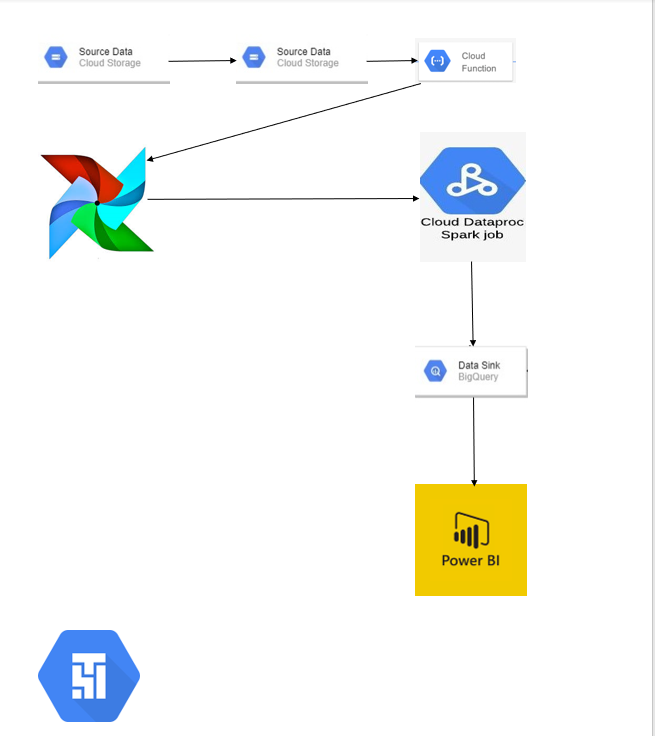
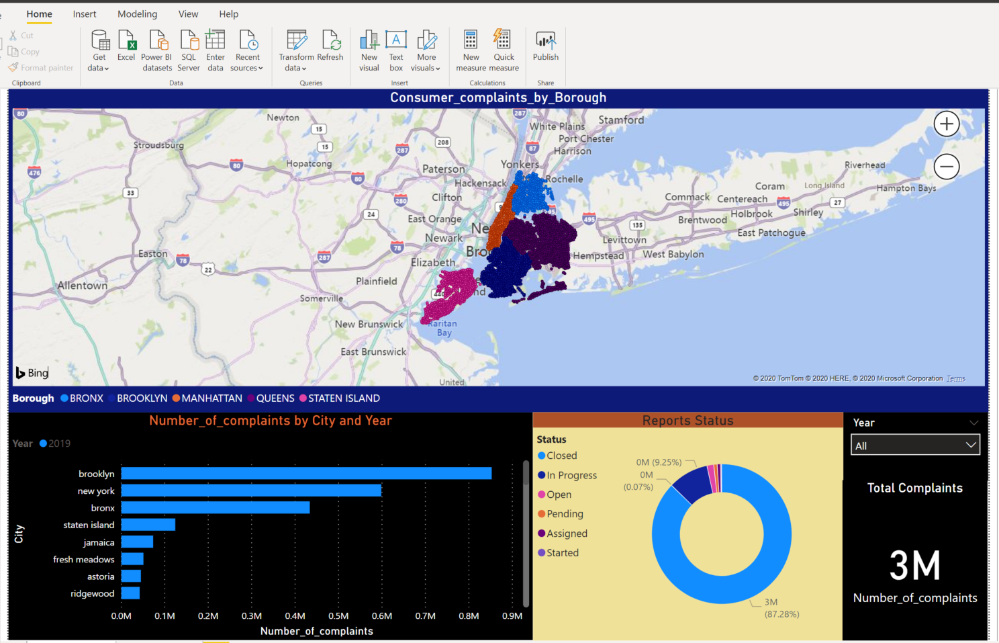
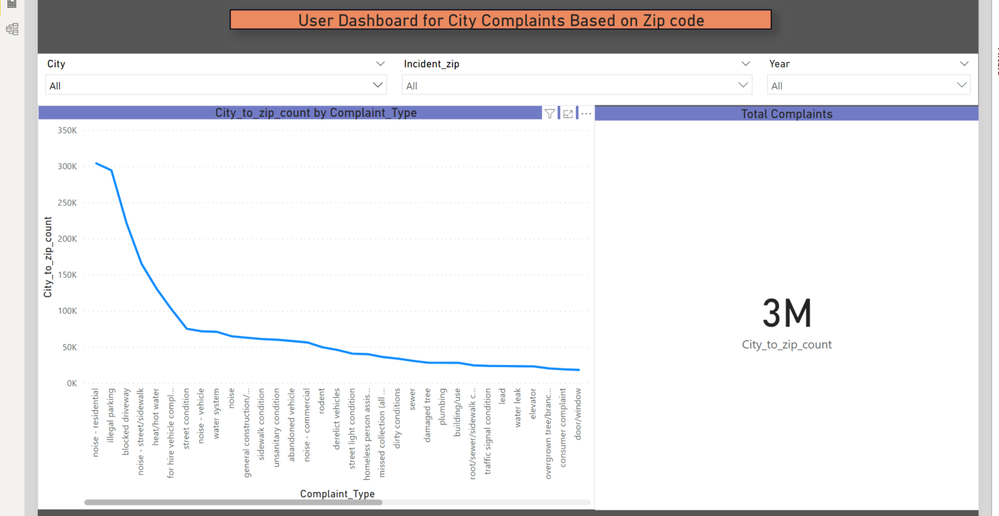

# 311-complaints-data_pipeline_gcp
* Provide an brief analysis of 311 complaints user dashboard, where user can find complaints based on city and zipcode and find an best and suitable location in the NewYork City  
## Table of Contents
1. Overview 
2. Pipeline Overview
3. Procedure
4. Dashboards and Results

### OVERVIEW
* Idea of project is to provide complaints overview and provide users to select best locations with low complaints in the New York City, Example Complaints with (Low Noise with Low Crime rate based on City)
* Used Google Cloud Platform to Analysis the Data
* Services Used
  - Google Cloud Storage
  - DataProc Cluster
  - Cloud Composer
  - Cloud Function
  - Bigquery
* Used Power BI for preparing Dashboard and automated the refresh when ever new data arrives

### Pipeline Overview

| |

### Procedure
* GCS bucket 1 will have all the part file each with 1GB of CSV and JSON files and using the Composer it copies data to GCS bucket 2
* An Automatic trigger will run on GCS bucket 2 which will run the Composer Dag
* Airflow Dag is designed to fetch the data from GCS bucket 2 and run spark Jobs on DataProc Cluster, which will automatically shutdown the cluster once the job is completed
* Finally After the all Transformations Dataproc will store the results into the BigQuery Table and stops the DataProc Cluster
* Once Data is ready in BigQuery, In Final step BigQuery Transformations task will run the BQL commands and Insert the data to the new created tables which will be useful for analysis.

### Dashboards and Results
* Here is an brief overview of the User-dashboard where user can search complaints based on City and Zipcode and find the top complaints in the specific zipcode

| |

* This dashboard describes the Entire analyis of 311-NYC-complaints
| |

