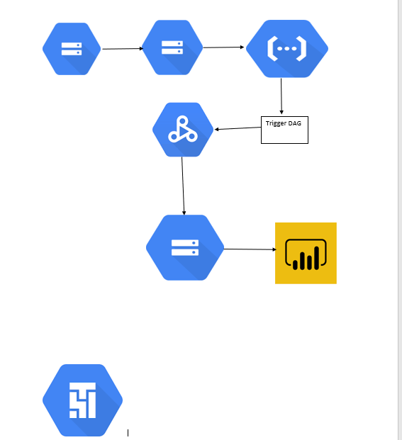
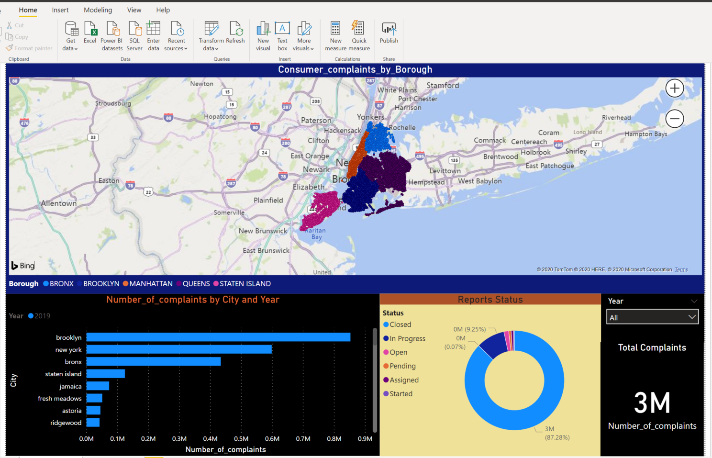
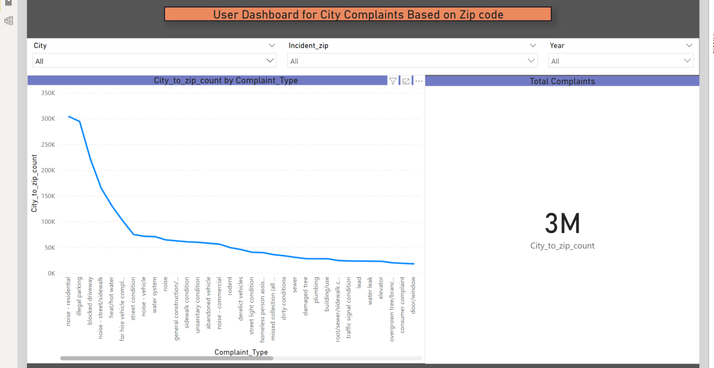

# 311-complaints-data_pipeline_gcp
## Idea of project is create an Pipeline to analyse the 311-dataset using the GCP cloud

## OVERVIEW

### Used Services, Utilized Cloud Composer, Cloud Storage, DataProc, BigQuery and Cloud functions

### Pipeline Overview

   
| |

### Conclusion analyzed the results using the POWERBI

| |

| |

### Visualization shows the complaints analysis with vaious filter using the POWER BI 
